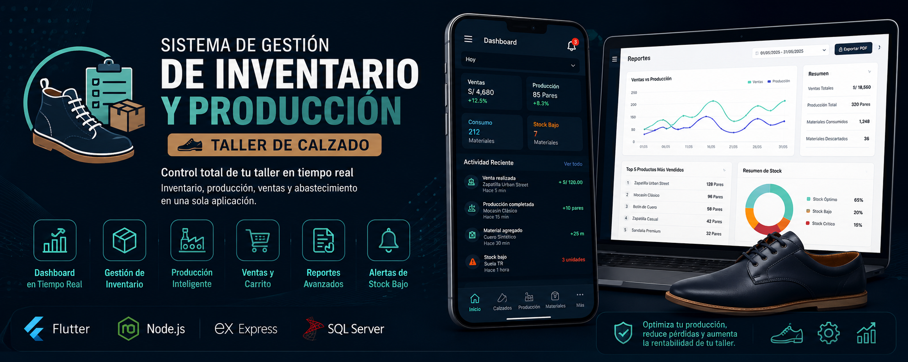

<p align="center">
  
</p>

# Sistema de Gestión de Inventario y Producción para Taller de Calzado

<p align="center">
  <strong>Gestión inteligente de inventario · Producción automatizada · Ventas · Reportes</strong>
</p>

<p align="center">
  
  
  
  
  
</p>

---

## Tabla de Contenidos

- [Arquitectura del Sistema](#arquitectura-del-sistema)
- [Características Principales](#características-principales)
- [Tecnologías Utilizadas](#tecnologías-utilizadas)
- [Guía de Instalación](#guía-de-instalación)

---

## Arquitectura del Sistema

El proyecto está compuesto por tres capas principales conectadas a través de Internet:

**Aplicación Móvil (Cliente)**
Desarrollada en Flutter, ofrece una interfaz intuitiva con dashboards dinámicos, animaciones fluidas y control visual inteligente de stock crítico.

**Servidor API REST (Backend)**
Construido con Node.js y Express, gestiona la lógica de negocio de manera segura y expone los endpoints consumidos por la aplicación móvil.

**Base de Datos (Nube)**
Motor SQL Server alojado en un servidor remoto (site4now.net). Implementa restricciones relacionales avanzadas y procedimientos almacenados transaccionales para garantizar la integridad de los datos.

---

## Características Principales

### Dashboard en Tiempo Real
- KPIs dinámicos según filtro seleccionado (Ventas, Producción, Consumo, Abastecimiento, Descarte)
- Historial de actividad reciente con detalle de movimientos
- Alertas automáticas de stock bajo de materiales
- Notificaciones en tiempo real con auto-eliminación

### Gestión de Calzados
- Catálogo completo con imágenes y filtros por tipo
- Control de stock y precios actualizados
- Botón rápido para producción automática
- Visualización de variantes (color, talla)

### Gestión de Materiales (Insumos)
- Registro, edición y eliminación de materiales
- Control de stock con alertas críticas (menos de 5 unidades)
- Categorización por tipo de insumo
- Abastecimiento con historial de movimientos

### Producción Automática Inteligente
- Sistema basado en recetas predefinidas
- Cada calzado tiene su receta de materiales configurada
- Validación automática de stock disponible
- Cálculo automático de materiales consumidos
- Registro en historial de producción

### Ventas y Carrito de Compras
- Agregar productos al carrito con validación de stock
- Confirmación de ventas con rollback automático
- Historial de ventas con detalle de productos
- Actualización automática de inventario

### Reportes y Estadísticas Avanzadas
- Gráficos interactivos con agrupación inteligente (Día, Semana, Mes, Año)
- Exportación a PDF
- Comparativa Ventas vs Producción por período
- Top 5 productos más vendidos y producidos
- Resumen de stock actual

---

## Tecnologías Utilizadas

| Tecnología | Propósito |
|------------|-----------|
| Flutter | Frontend móvil con Provider para gestión de estado |
| Node.js + Express | API REST Backend |
| SQL Server | Base de datos en la nube con procedimientos almacenados transaccionales |
| HTTP | Comunicación cliente-servidor |
| Printing | Exportación de reportes a PDF |

---

## Guía de Instalación y Configuración

### Aplicación Móvil (Flutter)

```bash
# Clonar el repositorio
git clone https://github.com/JosueSA12/Inventario_Calazado_APP.git

# Ingresar al directorio
cd Inventario_Calazado_APP

# Instalar dependencias
flutter pub get

# Configurar URL base en los providers
# baseUrl: "http://tu-ip:3000/api"

# Ejecutar la aplicación
flutter run

## Contacto

**Josue Solano**  
Email: solanoamarantoj@gmail.com  
GitHub: [@tusuario](https://github.com/JosueSA12) 